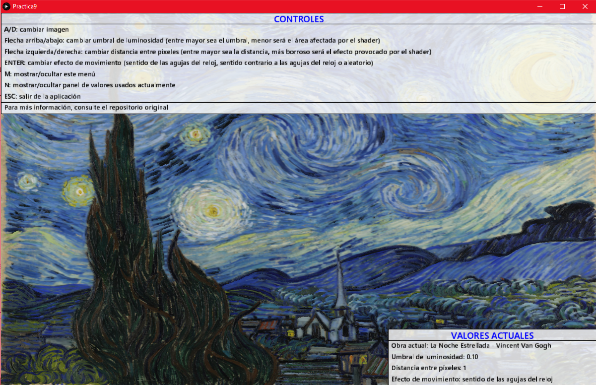

# Práctica 9 - Prototipo con *Shaders*


## Memoria

### Autor

Kevin David Rosales Santana - <kevin.rosales101@alu.ulpgc.es>

### Índice

1. [Introducción](#1-introducción)
2. [Muestra del resultado](#2-muestra-del-resultado)
3. [Descripción del trabajo realizado](#3-descripción-del-trabajo-realizado)

   3.1 [Estructura de ficheros](#31-estructura-de-ficheros)
   
   3.2 [Decisiones en el desarrollo](#32-decisiones-en-el-desarrollo)
   
      - 3.2.1 [Filtrado de *píxel*](#321-filtrado-de-pixel)
      - 3.2.2 [Desplazamiento de *píxel*](#322-desplazamiento-de-texel)
      - 3.2.3 [Rotación de *píxel* usando un *kernel*](#323-rotación-de-texel-usando-un-kernel)
      - 3.2.4 [Interfaz gráfica](#323-interfaz-gráfica)
   
4. [Conclusión](#4-conclusión)
5. [Ejecución del Proyecto](#5-ejecución-del-proyecto)
6. [Referencias y herramientas utilizadas](#6-referencias-y-herramientas-utilizadas)

### 1. Introducción

En la presente práctica se pedía implementar un **prototipo que hiciera uso al menos de un *shader* de fragmentos (sugiriendo que se creara algún procesamiento sobre imagen)**, sirviendo para el aprendizaje de *Processing*, el cual tiene como objetivo facilitar los desarrollos con fines creativos en entornos digitales. 

En este repositorio se tiene la implementación un prototipo que cumple dichos requisitos. Concretamente, **el usuario podrá interactuar con cuadros artísticos, pudiendo otorgarles una sensación de movimiento en su fondo** dado una serie de parámetros que se expondrán a lo largo de la presente memoria.

### 2. Muestra del resultado

<div align="center">
   </img>
   <p>Figura 1: Muestra de resultado</p>
</div>
**Nota**: el resultado real no es tan oscuro como se muestra en la captura de la *Figura 1*.

### 3. Descripción del trabajo realizado

#### 3.1 Estructura de ficheros

Para realizar este trabajo, se ha creado estos ficheros (presente en la carpeta [Practica9](Practica9/)):

| Fichero         | Descripción                                                  |
| :-------------- | :----------------------------------------------------------- |
| *Practica9.pde* | Fichero encargado de la **gestión de las llamadas al *shader* y de la interacción del usuario con el proyecto**. Al ser el fichero principal, gestiona el `setup()` y el `draw()` del proyecto haciendo uso una serie de funciones auxiliares. Es el encargado de dibujar la interfaz gráfica (menú de controles y de valores actuales usados) y de gestionar los eventos de teclado. |
| *shader.glsl*   | Fichero encargado de la **gestión del *Shader***, el cual actúa sobre el cuadro seleccionado y trata de otorgarle un efecto de movimiento a su fondo. |

<div align="center">
   <p>Tabla 1: Estructura de ficheros</p>
</div>

#### 3.2 Decisiones en el desarrollo

A la hora de realizar el proyecto se ha tenido que tomar una serie de decisiones respecto al desarrollo de este. A continuación, se listarán dichas decisiones:

##### 3.2.1 Filtrado de *píxel*

El primer paso para realizar efecto expuesto en la *Figura 1* es reconocer **qué pixeles deben transformarse.** Para ello, se debe recoger de cada *pixel* **una medida de su luminosidad**. **Si la luminosidad es mayor al umbral que ha definido el usuario, ese pixel sufrirá el efecto de *shading* posteriormente.**

```glsl
[...]
vec4 col4 = textureOffset(texture, vertTexCoord.st, ivec2(0,0)); //Centro
[...]

float brightness = (col4.r, col4.g, col4.b) / 3.0;
if (threshold < brightness) direction = directionValue;
```

<div align="center">
   <p>Fragmento de código 1: Aplicación de umbral para la selección de píxeles a cambiar</p>
</div>

##### 3.2.2 Desplazamiento de *píxel*

Para poder realizar un efecto de desenfoque, es necesario que a la hora de aplicar el [kernel que definirá la rotación](#323-rotación-de-píxeles-usando-un-kernel) **se aplique un desplazamiento determinista en la selección de sus píxeles.** Este desplazamiento se consigue mediante la función de *OpenGL* `textureOffset(gsampler2D sampler, vec2 P, ivec2 offset)`.

Gracias a **realizar una suma ponderada** (que dependerá de la dirección que esté siendo aplicada en ese momento) **de los colores de todos los píxeles escogidos con una distancia arbitraria, se tendrá el efecto de desenfoque buscado**. Entre mayor sea la distancia introducida por el usuario, mayor será el efecto.

```glsl
vec4 col0 = textureOffset(texture, vertTexCoord.st, ivec2(-offset, -offset)); //Esquina superior izquierda
vec4 col1 = textureOffset(texture, vertTexCoord.st, ivec2(0, -offset)); //Centro superior
vec4 col2 = textureOffset(texture, vertTexCoord.st, ivec2(+offset, -offset)); //Esquina superior derecha
vec4 col3 = textureOffset(texture, vertTexCoord.st, ivec2(-offset, 0)); //Centro izquierda
vec4 col4 = textureOffset(texture, vertTexCoord.st, ivec2(0, 0)); //Centro
vec4 col5 = textureOffset(texture, vertTexCoord.st, ivec2(+offset, 0)); //Centro derecha
vec4 col6 = textureOffset(texture, vertTexCoord.st, ivec2(-offset, +offset)); //Esquina inferior izquierda
vec4 col7 = textureOffset(texture, vertTexCoord.st, ivec2(0, +offset)); //Centro inferior
vec4 col8 = textureOffset(texture, vertTexCoord.st, ivec2(+offset, +offset)); //Esquina inferior derecha
```

<div align="center">
   <p>Fragmento de código 2: Colores de píxeles cercanos con desplazamiento arbitrario para el efecto de difuminado</p>
</div>

<div align="center">
   </img>
   <p>Figura 2: Efecto de desenfoque</p>
</div>

##### 3.2.3 Rotación de *píxel* usando un *kernel*

Tras recoger los colores de píxeles adecuados por cada píxel entrante, es necesario **aplicar un *kernel* distinto dependiendo de la dirección que introduzca el `draw()` el *Processing*.** Para ello, en cada iteración y **dependiendo del efecto de movimiento seleccionado por el usuario** (*sentido de las agujas del reloj*, *sentido contrario a las agujas del reloj* o *random*), **se aplica un *kernel* que le da más peso hacia la dirección del píxel que se deba escoger.**

Con este algoritmo, se logra el efecto de movimiento que se buscaba en el proyecto sobre la imagen original.

```glsl
vec4 sum;
switch(direction){
  case 0:
    sum = col4;
    break;
    
  case 1:
    sum = (0.5 * col4 + 1.5 * col3 + 2.5 * col6 + 1.5 * col7) / 6.0 ;
    break;
    
  case 2:
    sum = (0.5 * col4 + 1.5 * col6 + 2.5 * col7 + 1.5 * col8) / 6.0 ;
    break;
    
  case 3:
    sum = (0.5 * col4 + 1.5 * col7 + 2.5 * col8 + 1.5 * col5) / 6.0 ;
    break;
    
  case 4:
    sum = (0.5 * col4 + 1.5 * col8 + 2.5 * col5 + 1.5 * col2) / 6.0;
    break;
    
  case 5:
    sum = (0.5 * col4 + 1.5 * col5 + 2.5 * col2 + 1.5 * col1) / 6.0 ;
    break;
    
  case 6:
    sum = (0.5 * col4 + 1.5 * col2 + 2.5 * col1 + 1.5 * col0) / 6.0 ;
    break;
    
  case 7:
    sum = (0.5 * col4 + 1.5 * col1 + 2.5 * col0 + 1.5 * col3) / 6.0 ;
    break;
    
  case 8:
    sum = (0.5 * col4 + 1.5 * col0 + 2.5 * col3 + 1.5 * col6) / 6.0;
    break;
    
  default:
    break;
}
gl_FragColor = vec4(sum.rgb, 1.0) * vertColor;  
```

<div align="center">
   <p>Fragmento de código 3: Efecto de movimiento provocado por un kernel dependiente de la dirección</p>
</div>

Nótese que, en caso de que el valor del color del píxel entrante sea inferior al [umbral]((#321-filtrado-de-pixel)), no se aplica ningún *kernel* para aplicar el efecto de desplazamiento (`direccion = 0`). Esto provoca que **en las obras exista una parte estática (que coincide con los colores oscuros), provocando que sea el fondo (colores más claros) los que transmitan el movimiento y el desenfoque.**

<div align="center">
   </img>
   <p>Figura 3: Efecto de movimiento tras la aplicación de <i>kernels</i> dependientes de direcciones sucesivas y aleatorias</p>
</div>

**Se anima al usuario a tratar de encontrar la mejor combinación visual para cada obra de arte parametrizando:**

- El umbral de luminosidad.
- La distancia entre píxeles.
- El efecto de movimiento.

##### 3.2.4 Interfaz gráfica

Debido a la cantidad de opciones con las que puede interactuar el usuario, **se hace necesario crear una interfaz gráfica que explique cómo realizar cada una de las acciones disponibles** (permitiendo ocultar tanto el menú de controles como el de los valores usados actualmente).

<div align="center">
   </img>
   <p>Figura 4: Interfaz gráfica de usuario con menús visibles</p>
</div>

### 4. Conclusión

Esta práctica ha servido una vez más como **aprendizaje para *Processing*** y, además, se ha tratado de una práctica muy entretenida donde se ha tenido contacto con una herramienta que sirve para aprender diferentes formas y utilidades que permiten interactuar con el procesamiento de una imagen.

*Processing* para ello otorga una serie de funciones muy útiles y con cometidos muy distintos que permiten realizar tareas tan variadas como la que se puede observar en este repositorio. Se ha podido observar cómo el uso de *Processing* [(ver referencia 2)](#6-referencias-y-herramientas-utilizadas) puede resultar fundamental **para entender el funcionamiento de los *shaders*** (en este caso de fragmentos).

Por último, se debe recalcar que gracias a esta novena práctica de *Creando Interfaces de Usuario*, se ha podido aprender a desarrollar una práctica donde **la interacción del usuario también vuelve a ser una de las claves más importantes en el diseño y desarrollo de aplicaciones y donde se debe tratar de otorgar la mayoría de facilidades disponibles al usuario final.** En este caso, se ha hecho especial hincapié en explicar al usuario la acción que realiza cada una de las interacciones disponibles.

### 5. Ejecución del proyecto

Para ejecutar este proyecto, es necesario:

- Tener instalado [Processing (Referencia 3)](https://github.com/kevinrosalesdev/CIU-Practica7#6-referencias-y-herramientas-utilizadas)

Para ejecutar el proyecto, tan solo se debe abrir el fichero [Practica9.pde](Practica9/Practica9.pde) y darle al botón de ejecutar.

### 6. Referencias y herramientas utilizadas

- [1] Modesto Fernando Castrillón Santana, José Daniel Hernández Sosa. [Creando Interfaces de Usuario. Guion de Prácticas.](https://cv-aep.ulpgc.es/cv/ulpgctp20/pluginfile.php/126724/mod_resource/content/25/CIU_Pr_cticas.pdf)
- [2] Processing Foundation. [Processing Reference.](https://processing.org/reference/)
- [3] Processing Foundation. [Processing Download.](https://processing.org/download/)
- [4] Extrapixel. [GifAnimation Processing Library.](https://github.com/extrapixel/gif-animation)
